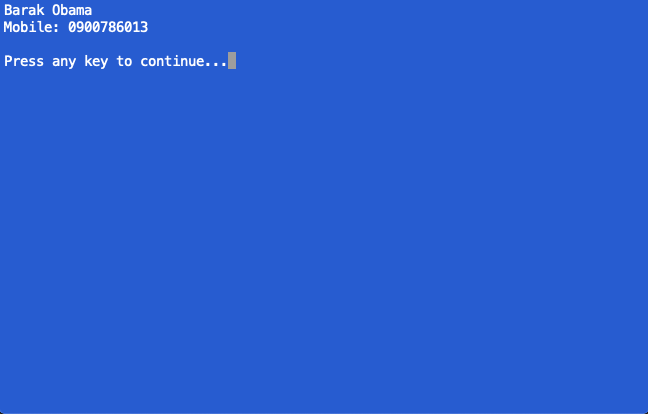

# Deserialise Json Data to C sharp objects...

**A very small console app that reads data from a text file in json format and deserialise it to C# objects..**

 ๏	 *For now the text file acting as a data source however, for future use, the same concept can be used to make Web API calls via HttpClient and the results can be deserialised into C# objects.*

